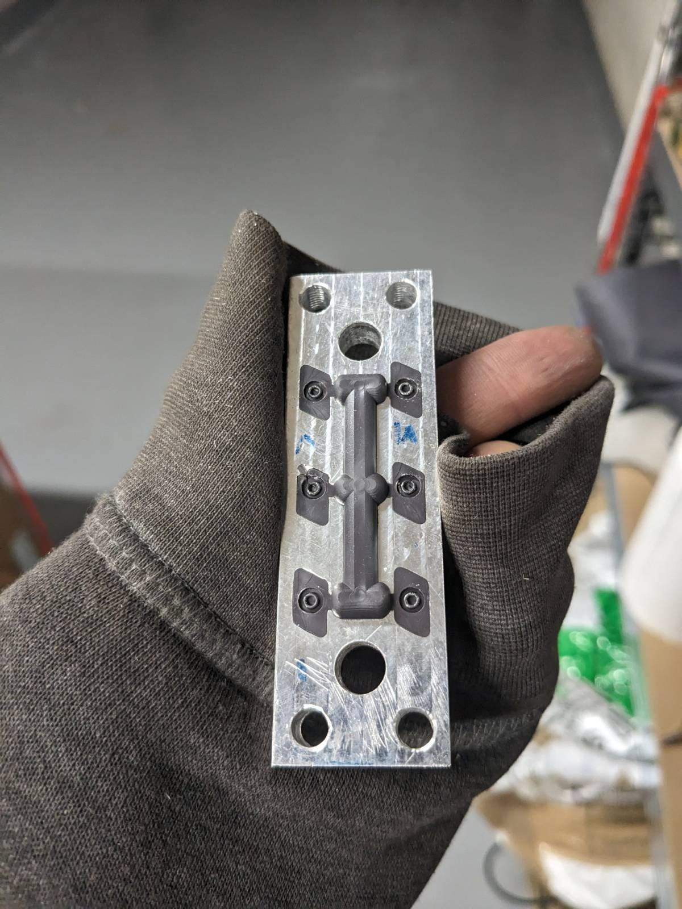
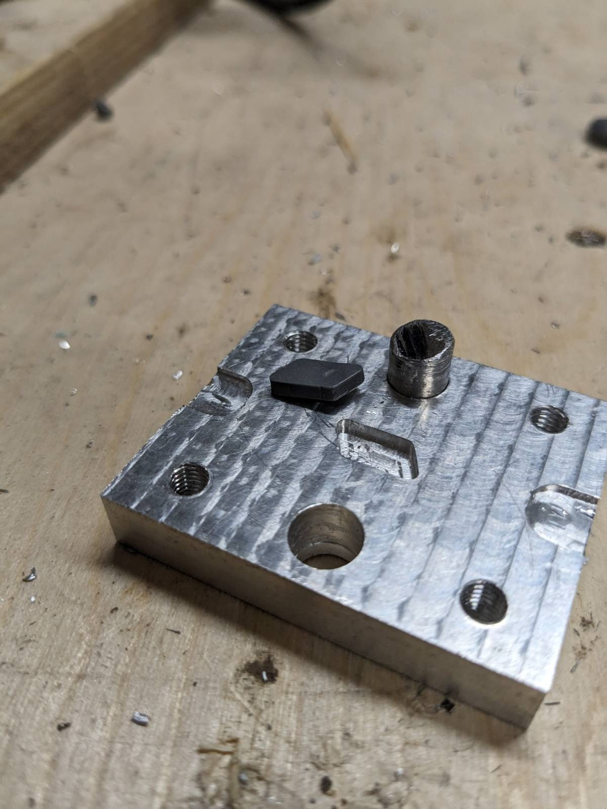

## IO Science Club
In 2018 I started IO Science Club at the University of Technology in Bialystok. Our goal is to gather people with the passion to earn knowledge, create DIY projects, and discover new things. 
In our team, you can find CNC and 3D printer hobbyists, electronic designers, programmists, IoT passionates, drone and RC pilots, and many others. With our knowledge spread in many topics as well as extensive workshop with tools and CNC machines, we can create incredible projects.
Since the beginning, we have been in many competitions and started projects such as an electric skateboard, solar pannel charging station, electric bike, CNC machine, SCARA robot, and Assistive Device for People with Disabilities. Also, we took part in many university promotional events. 

## OpenStreetMaps coding format
For the purpose of displaying user location on the embedded device, I have designed and implemented OpenStreetMaps coding format. I have created an encoder as well as a decoder in Python. As the result format was presented on the embedded device. 

**[Project won the second place in the national competition for the best article about electronics or programming.](https://forbot.pl/forum/topic/19798-przetwarzanie-openstreetmap-na-systemie-wbudowanym-1-format-osm/)**

## Bike computer
The project is in commercialization. I have designed all parts of the project such as PCB, C code for an embedded platform, Android application in Kotlin, plastic case, manufacturing process (using CNC milling, injection molding, and other processes)

## Multifuncitonal CNC machine
I have designed a multifunctional CNC machine that allows to mill, 3D print and laser engrave.
I was presenting the project at ***[Milset Expo-Sciences International in Abu Zabi.](https://www.youtube.com/watch?v=2gOhcgbjxlo)*** 

Nowadays I modified the machine only for milling purposes and I am creating injection molding molds.

## Programmable bionic hand
Many solutions of bionic hands base on detecting muscle contractions to define the desired movement of the prosthetic limb. For the last 10 years, this method has not been developed further in prosthetic applications. The main problem with using EMG (electromyography) to control bionic hand is limiting the possibilities of grips to only a few of them. Unfortunately, there are various of situations when precise control of each hand joint movement is needed. Also, EMG works perfectly only in the laboratory and any sweat or higher humidity makes muscle contractions very hard to detect. This project presents a new possibility of bionic hand control. By creating a glove that is able to measure the bend angle of each joint placed in a human hand, amputees will find it a more suitable solution to control bionic limb, than current bionic designs. Eliminating the need for usage electromyography to control bionic limb reduces the purchase costs of full setup and allows to control of bionic hands for most of the amputees. The creation of a bionic hand with 16 DOF points combined with a control glove ensures the high position accuracy of each phalanges.

***The project became a finalist in the competition Youth Science Meeting 2020.***

The project was made from scratch, all parts of the project were designed and made by me.
